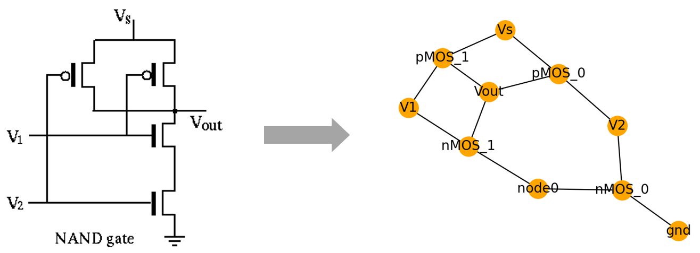
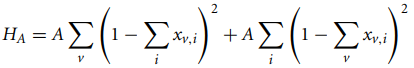
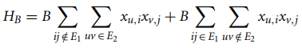

# Circuit Equivalence

This demonstration addresses the task of verifying the equivalence of two
representations of the design of an electronic circuit, which is of interest in
the field of electronic design automation.  By converting the representation of
each circuit into a graph, the problem can be reduced to that of determining
whether the two graphs are
[isomorphic](https://en.wikipedia.org/wiki/Graph_isomorphism).  The two graphs
are said to be isomorphic if there is a one-to-one-correspondence between the
vertex sets such that the adjacency relationships are identical.  Graph
isomorphism is a problem of general interest, and it is not currently known
whether it is NP complete [1].

The following figure depicts the schematic representation of a CMOS NAND gate,
along with the corresponding graph:



## Usage

To run the demonstration, execute:

```bash
python equivalence.py --show-plot
```

Or:

```bash
python equivalence.py --save-plot
```

Either of these commands solves the circuit equivalence problem for two
different descriptions of a CMOS NAND gate (provided in the `cmos_nand_1.txt`
and `cmos_nand2.txt` files in the `netlists` directory).  Other circuit
descriptions may be used as input by providing them as positional arguments in
the execution command.  The `--show-plot` and `--save-plot` flags are optional,
and they generate a plot of the graphs of the two circuits, using colors to
indicate the identified node correspondence.  The `--show-plot` flag displays an
interactive plot using matplotlib, and `--save-plot` saves the plot to a file.
Run `python equivalence.py -h` for a description of the command line options.

## Code Overview

The code uses the following steps:

- Each of the two netlist files specified on the command line (or the default
  example files) is parsed, constructing a list of components for each of the
  two circuit descriptions.
- Each circuit is then converted into a graph where each element in the circuit
  is represented by a node in the graph, and edges are used to represent
  connections between the elements in the circuit.
- Next, a discrete quadratic model (DQM) is constructed such that the [objective
  function](https://docs.dwavesys.com/docs/latest/c_gs_3.html) represents the
  problem of finding an isomorphism between the two graphs.  Further details are
  given in the next section.
- The DQM is then solved on the hybrid quantum-classical computing resource
  using the LeapHybridDQMSampler.
- Each result in the SampleSet is then checked to determine whether (a) it
  indicates an isomorphism and (b) the identified isomorphism represents
  equivalent circuits (e.g., that a pMOS transistor in the first circuit is
  mapped to a pMOS transistor in the second).

The code is set up to read circuit definitions from
[netlist](https://en.wikipedia.org/wiki/Netlist) files in a simple text format.
Several example netlist files are provided in the `netlists` directory:

- `cmos_nand_1.txt`: Specification of a CMOS NAND gate
- `cmos_nand_2.txt`: Alternative specification of a CMOS NAND gate, using only
  small changes in the naming of the components and the ordering of the
  definitions, relative to `cmos_nand_1.txt`
- `cmos_nand_error.txt`: An example of an incorrect specification of a CMOS
  NAND gate, which is not equivalent to the correct representation
- `cmos_nor_1.txt`: Specification of a CMOS NOR gate.  This circuit does produce
  a graph that is isomorphic with that of the CMOS NAND gate, but with the pMOS
  and nMOS transistors swapped.  The example code checks for matches in the
  transistor types of corresponding nodes identified by the graph isomorphism,
  so it should determine that the NAND and NOR gate netlists are not equivalent.


When the netlist files are not explicitly named on the command line, the program
defaults to using `cmos_nand_1.txt` and `cmos_nand_2.txt`.


## Code Specifics

The core part of the code involves formulating the graph isomorphism problem as
a discrete quadratic model that can be solved on the Leap hybrid solvers.  The
general approach is based on that outlined by Lucas [2], which describes
formulation as a binary quadratic model.  In Lucas's formulation, there are
`N*N` binary variables `x_{v,i}` (N denotes that number of nodes in each graph,
which must be the same for there to be an isomorphism) that represent whether a
vertex in the first graph gets mapped to a vertex in the second graph.

The objective function is expressed as two components, `H_A` and `H_B`
(Eqs. (71) and (72) in [2]).  The first component, `H_A`, is used to enforce the
constraint that each vertex in each of the two graphs is selected exactly once:



We are able to simplify this equation by taking advantage of the discrete
quadratic model representation.  Instead of using `N*N` binary variables, we use
N discrete variables, each having N cases.  We let each discrete variable
represent a node in the first graph, and the N cases represent nodes in the
second graph.  This way, the constraint of choosing each node in the first graph
once is implicitly enforced, and only the first of the two terms in the original
`H_A` equation is needed.

The second component, `H_B` (Eq. (72)), uses interaction terms to penalize
settings that select an edge in the first graph that is not in the second graph,
or vice versa:



The interaction coefficients associated with `H_B` are defined in the code using
two double-loops.  Each double-loop includes an outer loop over the edges of one
of the two graphs, along with an inner loop over all possible node combinations,
so that penalty coefficients can be added for all combinations that are invalid.

The discrete quadratic model is then solved using the LeapHybridDQMSampler.  If
the two graphs are isomorphic, then the ground state energy is zero.

To check for circuit equivalence, we check two conditions: first, there must be
an isomorphism between the two graphs.  This can be determined based on the
energy values found in the DQM solution.  Second, for each isomorphism, we check
that the corresponding circuit components are compatible.  For the examples
here, we simply check for compatibility of transistors (nMOS cannot be swapped
with pMOS).

Some further simplifications to the formulation are possible, as discussed in
Ref. [3].  For example, only nodes with the same degree in each graph are
eligible to be matched.  In the DQM formulation, this could be achieved by
reducing the number of cases for each discrete variable so that only cases
corresponding to nodes with an equal degree are included.  This has the
potential to significantly reduce the problem size, at the expense of additional
bookkeeping to track the target nodes being represented by each discrete variable
case.

## References

[1] Johnson, DS. The NP-completeness column. ACM Transactions on Algorithms,
2005, 1-160. doi: 10.1145/1077464.1077476.

[2] Lucas, A. Ising formulations of many NP problems. Frontiers in
Physics, 2014. doi: 10.3389/fphy.2014.00005.

[3] Zick, M., Shehab, O., and French, M.  Experimental quantum annealing: case
study involving the graph isomorphism problem.  Scientific Reports 5, 2015. doi:
10.1038/srep11168.

## License

Released under the Apache License 2.0. See [LICENSE](LICENSE) file.
